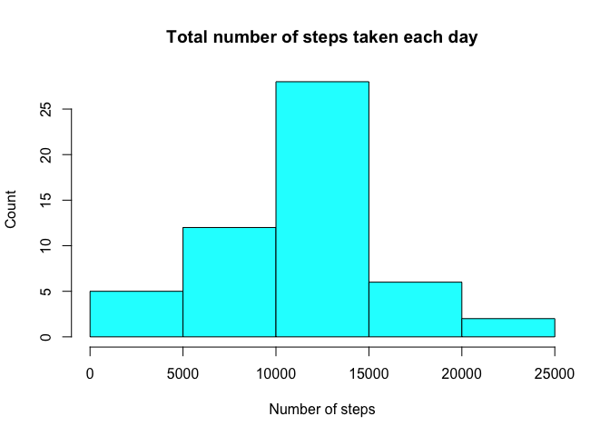
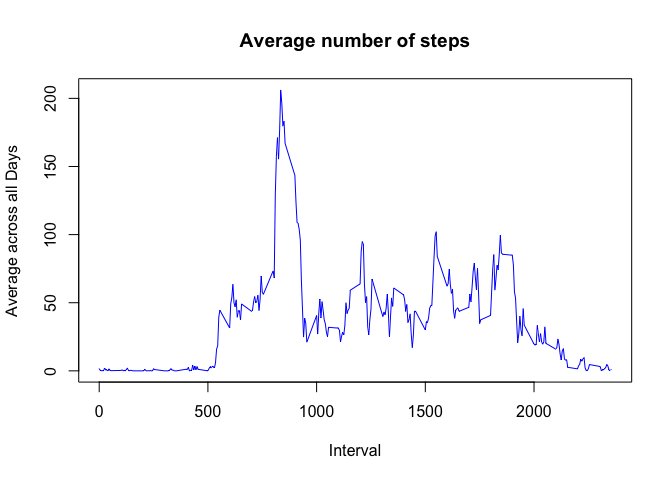
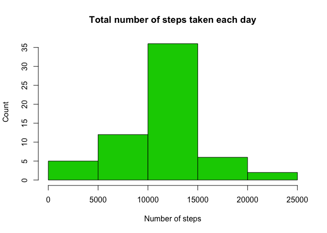
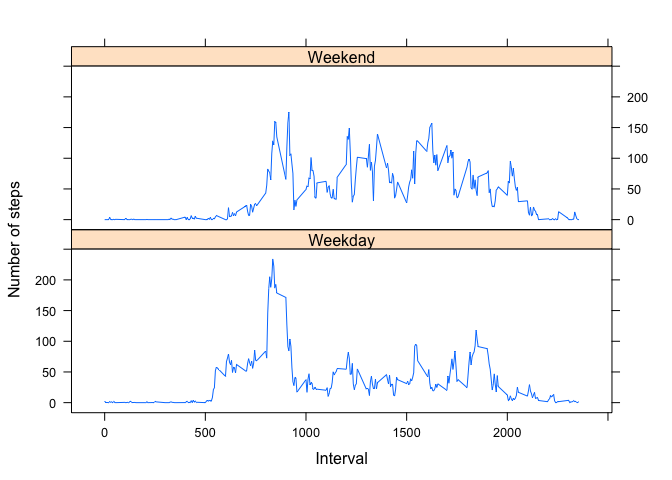

# Reproducible Research: Peer Assessment 1


## Loading and preprocessing the data

```r
library(dplyr)
library(lattice)
#loading the raw data
myRaw <- read.csv("activity.csv")
```
### NA's must be omitted as requested. keeps rawdata.

```r
file <- na.omit(myRaw)
```

## TASK 1 - What is mean total number of steps taken per day?

```r
#Vector of steps per day
DailyStepsVec <- rowsum(file$steps,file$date)
hist(DailyStepsVec, xlab="Number of steps", ylab="Count", main="Total number of steps taken each day", col = 5)
```

<!-- -->

```r
#will use sprintf to round those values below
MyMean <- mean(DailyStepsVec)
MyMedian <- median(DailyStepsVec)
```
##### The daily mean of the steps is 10766.19 and the median is 10765.00

## TASK 2 - What is the average daily activity pattern?


```r
myInterval <- tapply(file$steps, file$interval, mean)
plot(row.names(myInterval), myInterval, type = "l", xlab = "Interval", 
    ylab = "Average across all Days", main = "Average number of steps", 
    col = "blue")
```

<!-- -->

#### The highest average step count is in interval 835

## TASK 3 - Imputing missing values

```r
missing <- sum(is.na(myRaw))
```

#### There are 2304 missing values in the raw file


```r
#will complete NA values with the 5 min avg
avgSteps <- aggregate(steps ~ interval, data = myRaw, FUN = mean)
#NAs vector
newNAVec <- numeric()
for (i in 1:nrow(myRaw)) {
    myObs <- myRaw[i, ]
    if (is.na(myObs$steps)) {
        steps <- subset(avgSteps, interval == myObs$interval)$steps
    } else {
        steps <- myObs$steps
    }
    newNAVec <- c(newNAVec, steps)
}
#Create a new dataset that is equal to the original dataset but with the missing data filled in
newData <- myRaw
newData$steps <- newNAVec
#make a new hist with the new data with the median and mean
#Vector of steps per day
DailyStepsVec2 <- rowsum(newData$steps,newData$date)
hist(DailyStepsVec2, xlab="Number of steps", ylab="Count", main="Total number of steps taken each day", col = 3)
```

<!-- -->

```r
#will use sprintf to round those values below
MyMean2 <- mean(DailyStepsVec2)
MyMedian2 <- median(DailyStepsVec2)
strMean <- if (MyMean == MyMean2) "the same of " else "different then "
strMedian <- if (MyMedian == MyMedian2) "the same of " else "different then "
```
##### The new daily mean of the steps is 10766.19 and it's the same of  the previous value (10766.19)
##### The new daily median of the steps is 10766.19 and it's different then  the previous value (10765.00)

## TASK 4 - Are there differences in activity patterns between weekdays and weekends?

```r
myRaw$date <- as.Date(myRaw$date)
day <- weekdays(myRaw$date)
daylevel <- vector()
for (i in 1:nrow(myRaw)) {
    daylevel[i] <- (if (day[i] == "Saturday" || day[i] == "Sunday" ) "Weekend" else "Weekday")
}
myRaw$daylevel <- daylevel
myRaw$daylevel <- factor(myRaw$daylevel)

StepsAgg <- aggregate(steps ~ interval + daylevel, data = myRaw, mean)
names(StepsAgg) <- c("interval", "daylevel", "steps")
```
### Comparing patterns

```r
xyplot(steps ~ interval | daylevel, StepsAgg, type = "l", layout = c(1, 2), 
    xlab = "Interval", ylab = "Number of steps")
```

<!-- -->
